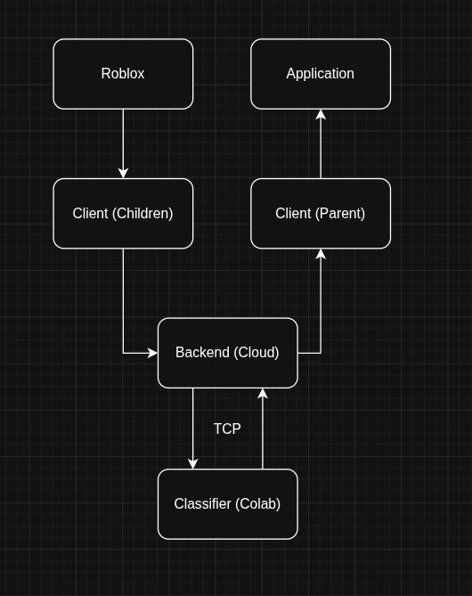
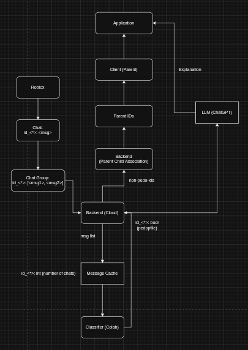

# TellMom
TellMom is a privacy-first AI safety app that monitors children's gaming interactions, detects online threats, and alerts parents with actionable evidence.

Theme: Cybersecurity and Privacy.

# Problem Statement
Online games have become an important part of children's social lives, allowing them to communicate, make friends, and participate in virtual communities. However, these platforms also expose children to risks such as online grooming, cyberbullying, scams, and the accidental sharing of personal information.

Recent reports have highlighted the scale of this challenge. In 2023, Roblox reported more than 13,000 child exploitation incidents to the National Center for Missing and Exploited Children, showing that online safety remains a significant concern for platforms with large numbers of young users. Harmful interactions often begin with seemingly harmless conversations, making them difficult for parents and traditional moderation systems to detect early.

# Solution
Therefore, we created TellMom to act as an intelligent early-warning system for families. By using AI-powered conversation analysis, TellMom helps identify potential threats before they escalate, giving parents the information they need to protect their children while respecting their privacy and independence using COPPA regulations.

# Current Architecture
How children Roblox are handled (This is a prototype, not a real production. For more details, look at Future Works)
```
Roblox (ChatService)
   ↓ (sends message)
Backend API (FastAPI)
   ↓ (runs AI detection)
AI Model (grooming_detector.py)
   ↓ (returns risk score)
Backend (creates alert)
   ↓ (broadcasts via WebSocket)
Frontend (React)
   ↓ (displays in real-time)
Dashboard
   -  Message appears on LEFT
   -  Risk assessment appears on RIGHT
   -  Alert pops up at top
```
Overall architecture:




# Technologies
Some kind of table or list yada yada

# Set up
```
python -m venv .venv
source ~/.venv/bin/activate

pip -r requirements.txt

# Open API
python app.py

# Run Frontend
cd src
npm start
```
# Future Works
For future works, our team will develop an Android app for practical purpose along with Advanced Computer Vision that will be used to continuously scan screens in the game of the children to detect for more further details of what going on visually, not just text-based. We will also expand the AI capability to detecting issues such as family information exposure and online bullying.