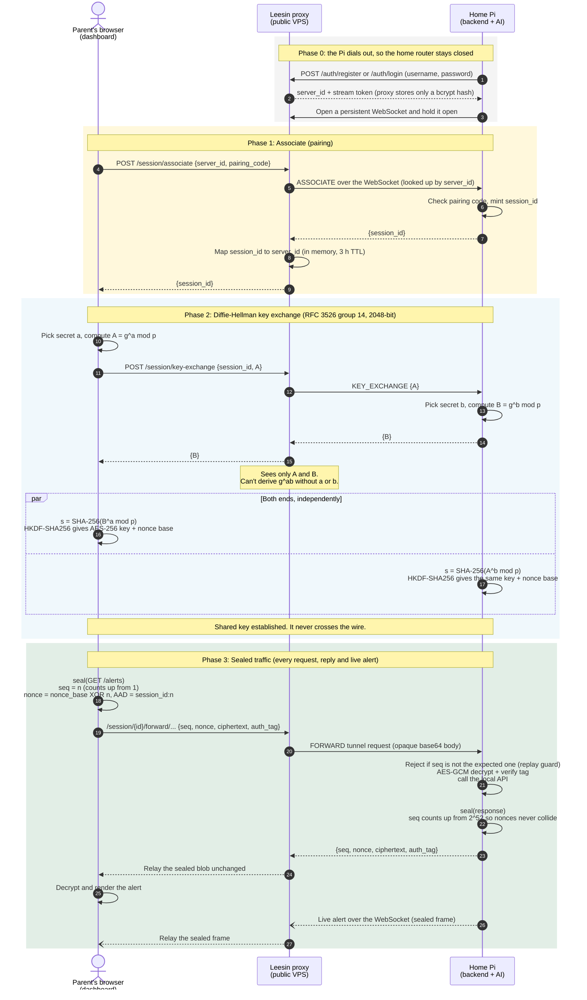
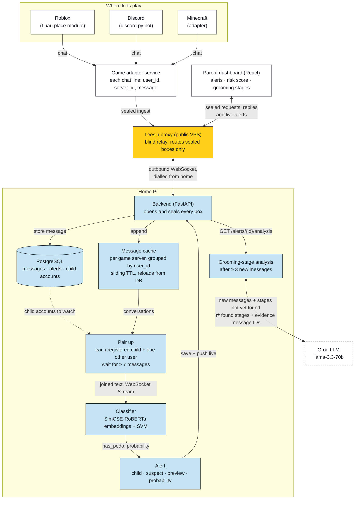

<div align="center">


# TellMom

<h2 style="color: #0056b3; font-size: 28px; font-weight: 800;">
  Keep your kids <span style="color: #d9534f;">SAFE</span> and your data <span style="color: #d9534f;">SECURED</span>
</h2>

TellMom catches grooming, scams and personal-info leaks in children's game chats, then alerts parents with the evidence. The AI runs on a **Raspberry Pi at home**. The cloud relay in the middle is **blind**.


---
</div>

## 01 · The problem

Online games are where kids hang out now. They talk, make friends and join communities there, and that also exposes them to **grooming, cyberbullying, scams and oversharing personal information**.

The numbers are grim. In 2023 alone, Roblox filed **13,000+ child exploitation reports** with the National Center for Missing and Exploited Children. Grooming rarely starts with an obvious red flag. It starts with *"you're so mature for your age"*, and that's too subtle for parents skimming chat logs or for keyword filters.

---

## 02 · The solution

TellMom is an **early-warning system for families**:

- **AI conversation analysis.** A SimCSE-RoBERTa encoder with an SVM head scores each conversation again every time a new message arrives, so threats get caught *before* they escalate.
- **Works where kids are.** Adapters for **Roblox**, **Discord** and **Minecraft**.
- **Real-time alerts** in a parent dashboard, with the message, who sent it and a risk score.
- **Your data stays home.** Chats, alerts and accounts live on your own Pi and never on our servers, in line with the spirit of COPPA.
- **The Leesin protocol.** Your phone reaches your Pi from anywhere through a proxy that's end-to-end locked out of your data. More on that below.

---

## 03 · The Leesin protocol

> *Lee Sin fights blindfolded, and so does our proxy.*

To check alerts from outside your home you need *something* public between your phone and your Pi. Usually that means trusting a server with everything. With Leesin, the proxy only routes sealed boxes: your browser and your Pi agree on a key the proxy never sees, and every request, reply and live alert crosses it as AES-256-GCM ciphertext.


```mermaid
sequenceDiagram
    autonumber
    actor Parent as Parent's browser<br/>(dashboard)
    participant Proxy as Leesin proxy<br/>(public VPS)
    participant Pi as Home Pi<br/>(backend + AI)

    rect rgba(160, 160, 160, 0.12)
    Note over Proxy,Pi: Phase 0: the Pi dials out, so the home router stays closed
    Pi->>Proxy: POST /auth/register or /auth/login (username, password)
    Proxy-->>Pi: server_id + stream token (proxy stores only a bcrypt hash)
    Pi->>Proxy: Open a persistent WebSocket and hold it open
    end

    rect rgba(255, 207, 26, 0.15)
    Note over Parent,Pi: Phase 1: Associate (pairing)
    Parent->>Proxy: POST /session/associate {server_id, pairing_code}
    Proxy->>Pi: ASSOCIATE over the WebSocket (looked up by server_id)
    Pi->>Pi: Check pairing code, mint session_id
    Pi-->>Proxy: {session_id}
    Proxy->>Proxy: Map session_id to server_id (in memory, 3 h TTL)
    Proxy-->>Parent: {session_id}
    end

    rect rgba(196, 227, 243, 0.25)
    Note over Parent,Pi: Phase 2: Diffie-Hellman key exchange (RFC 3526 group 14, 2048-bit)
    Parent->>Parent: Pick secret a, compute A = g^a mod p
    Parent->>Proxy: POST /session/key-exchange {session_id, A}
    Proxy->>Pi: KEY_EXCHANGE {A}
    Pi->>Pi: Pick secret b, compute B = g^b mod p
    Pi-->>Proxy: {B}
    Proxy-->>Parent: {B}
    Note over Proxy: Sees only A and B.<br/>Can't derive g^ab without a or b.
    par Both ends, independently
        Parent->>Parent: s = SHA-256(B^a mod p)<br/>HKDF-SHA256 gives AES-256 key + nonce base
    and
        Pi->>Pi: s = SHA-256(A^b mod p)<br/>HKDF-SHA256 gives the same key + nonce base
    end
    Note over Parent,Pi: Shared key established. It never crosses the wire.
    end

    rect rgba(63, 143, 90, 0.15)
    Note over Parent,Pi: Phase 3: Sealed traffic (every request, reply and live alert)
    Parent->>Parent: seal(GET /alerts)<br/>seq = n (counts up from 1)<br/>nonce = nonce_base XOR n, AAD = session_id:n
    Parent->>Proxy: /session/{id}/forward/... {seq, nonce, ciphertext, auth_tag}
    Proxy->>Pi: FORWARD tunnel request (opaque base64 body)
    Pi->>Pi: Reject if seq is not the expected one (replay guard)<br/>AES-GCM decrypt + verify tag<br/>call the local API
    Pi->>Pi: seal(response)<br/>seq counts up from 2^52 so nonces never collide
    Pi-->>Proxy: {seq, nonce, ciphertext, auth_tag}
    Proxy-->>Parent: Relay the sealed blob unchanged
    Parent->>Parent: Decrypt and render the alert
    Pi--)Proxy: Live alert over the WebSocket (sealed frame)
    Proxy--)Parent: Relay the sealed frame
    end
```

### What the proxy sees and what it never sees

| The proxy **can** see | The proxy **never** sees |
| --- | --- |
| Which home server a box is going to | What your child types or receives |
| How big each box is, and when it's sent | Alerts and risk scores |
| The pairing code, during pairing | Your children's game accounts |
| The DH public values `A` and `B` | Your dashboard password |
| | The AES key that opens the box |

### Why it holds up

- **Forward-secret sessions.** Each session runs a fresh Diffie-Hellman exchange, so there's no long-term key to steal.
- **AEAD everywhere.** AES-256-GCM with the `session_id:sequence` bound in as associated data. A tampered, reordered or cross-session box fails authentication.
- **Replay protection.** The Pi only accepts the exact next sequence number.
- **No nonce reuse.** Requests count up from `1` and responses from `2^52`, so the two directions can never produce the same nonce under the shared key. That matters, because the proxy holds both ciphertexts.
- **Minimal proxy state.** Server ID, username, bcrypt hash, and the session-to-server map, which is kept in memory only and expires after 3 hours.

> [!WARNING]
> **Known limits (we'd rather be honest):** the DH exchange isn't authenticated yet, so a proxy that *actively* swapped keys (man-in-the-middle) could read traffic. A passive or curious proxy learns nothing. The proxy can also see your dashboard login token in request headers, though it only unlocks replies the proxy can't open. Binding the exchange to the pairing code is on the roadmap.

The protocol lives in [`shared/services/security.py`](shared/services/security.py). The proxy is in [`proxy/`](proxy/) and the Pi side in [`backend/services/proxy_agent.py`](backend/services/proxy_agent.py). Game adapters pair with the Pi through the same sealed channel ([`adapters/client.py`](adapters/client.py)).

---

## 04 · Architecture


```mermaid
flowchart TB
    subgraph Games["Where kids play"]
        direction LR
        Roblox["Roblox<br/>(Luau place module)"]
        Discord["Discord<br/>(discord.py bot)"]
        Minecraft["Minecraft<br/>(adapter)"]
    end

    Adapter["Game adapter service<br/>each chat line: user_id, server_id, message"]
    Proxy["Leesin proxy (public VPS)<br/>blind relay: routes sealed boxes only"]
    Dash["Parent dashboard (React)<br/>alerts · risk score · grooming stages"]

    subgraph Pi["Home Pi"]
        Backend["Backend (FastAPI)<br/>opens and seals every box"]
        DB[("PostgreSQL<br/>messages · alerts · child accounts")]
        Cache["Message cache<br/>per game server, grouped by user_id<br/>sliding TTL, reloads from DB"]
        Pair["Pair up<br/>each registered child + one other user<br/>wait for ≥ 7 messages"]
        Classifier["Classifier<br/>SimCSE-RoBERTa embeddings + SVM"]
        Alert["Alert<br/>child · suspect · preview · probability"]
        Stages["Grooming-stage analysis<br/>after ≥ 3 new messages"]
    end

    LLM["Groq LLM<br/>llama-3.3-70b"]

    Roblox & Discord & Minecraft -- chat --> Adapter
    Adapter -- "sealed ingest" --> Proxy
    Dash <-- "sealed requests, replies<br/>and live alerts" --> Proxy
    Proxy <-- "outbound WebSocket,<br/>dialled from home" --> Backend

    Backend -- "store message" --> DB
    Backend -- append --> Cache
    DB -. "child accounts to watch" .-> Pair
    Cache -- "conversations" --> Pair
    Pair -- "joined text, WebSocket /stream" --> Classifier
    Classifier -- "has_pedo, probability" --> Alert
    Alert -- "save + push live" --> Backend
    Backend -- "GET /alerts/{id}/analysis" --> Stages
    Stages <-- "new messages + stages not yet found<br/>⇄ found stages + evidence message IDs" --> LLM

    classDef blind fill:#ffcf1a,stroke:#14181f,color:#14181f
    classDef home fill:#c4e3f3,stroke:#14181f,color:#14181f
    classDef edge fill:#ffffff,stroke:#14181f,color:#14181f
    classDef ext fill:#ffffff,stroke:#14181f,color:#14181f,stroke-dasharray: 4 3
    class Proxy blind
    class Backend,DB,Cache,Pair,Classifier,Alert,Stages home
    class Roblox,Discord,Minecraft,Adapter,Dash edge
    class LLM ext
```

1. **Collect.** An adapter reads the game chat and sends each line to the Pi, sealed, through the Leesin proxy. The Pi keeps its connection to the proxy open from the inside, so the home router stays closed.
2. **Store and group.** The backend writes every message to PostgreSQL and to an in-memory cache for that game server, grouped by sender.
3. **Pair up.** For each child account the parent registered, the backend builds a conversation from the child's messages plus one other user's messages. It waits for **7 messages** before judging.
4. **Classify.** The conversation goes to the classifier over a WebSocket. The classifier returns `has_pedo` and a probability, and it scores the conversation again every time a new message arrives.
5. **Alert.** A positive result saves an alert and pushes it to the dashboard as a sealed live frame.
6. **Explain.** When the parent opens the alert, the backend asks the LLM which of the seven grooming stages (victim selection through maintaining control) appear. It sends only the stages not found yet, and only once 3 or more new messages have arrived. Each stage comes back with the message that supports it.

> [!NOTE]
> The stage explanation is the one step that leaves the house: the conversation text for a flagged alert is sent to Groq. Classification and storage stay on the Pi.

---

## 05 · Tech stack

| Layer | Tech |
| --- | --- |
| **Backend** (home Pi) | Python 3.13, FastAPI, SQLAlchemy, PostgreSQL, Textual TUI |
| **Leesin proxy** | FastAPI + WebSockets, bcrypt, JWT |
| **Crypto** | Diffie-Hellman (RFC 3526 group 14), HKDF-SHA256, AES-256-GCM (`cryptography`) |
| **AI classifier** | SimCSE RoBERTa sentence embeddings + scikit-learn SVM |
| **Dashboard** | React, TypeScript, Vite, Tailwind CSS |
| **Game adapters** | Roblox (Luau via Rojo), Discord (`discord.py`), Minecraft |
| **Deploy** | Docker Compose, Traefik, Ansible, GitHub Actions |

---

## 06 · Getting started

**You'll need:** Python 3.13+, [`uv`](https://docs.astral.sh/uv/), Docker, Node.js, `psql` and `tmux`.

### One command (dev)

```bash
cp .env.example .env
./scripts/run-backend.sh
```

This installs dependencies, starts PostgreSQL, creates the database and opens a tmux session running the **proxy**, **backend**, **classifier** and **adapters**, plus the backend and adapter TUIs.

### Manually

```bash
uv sync
docker compose up -d              # PostgreSQL
sh ./scripts/create-db.sh

uv run python -m proxy.main       # Leesin proxy
uv run python -m backend.main     # home backend

cd classifier && cp .env.example .env && uv sync && uv run main.py    # AI classifier

uv run python -m backend.tui      # register with the proxy, get server ID + pairing code
uv run python -m adapters.main    # adapter service
uv run python -m adapters.tui     # start the Discord / Minecraft adapters
```

### Dashboard

```bash
cd frontend
npm install
npm run dev
```

Connect with your **server ID** and **pairing code**, add your child's game account, and alerts show up live.

> For Discord, set `DISCORD_BOT_TOKEN` in `backend/.env` or your environment. For Roblox, see [`adapters/roblox/roblox-chat-adaptor`](adapters/roblox/roblox-chat-adaptor/README.md).

### Tests

```bash
uv run pytest
```

The suite includes the security sequences (replay, tampering, nonce separation) and a full end-to-end flow through the proxy.

---

## 07 · Website & deployment

`site/` is the public showcase: an interactive tour of the Leesin protocol, the five-step build guide and a live classifier playground. It has no build step.

`deploy/` ships the public half of TellMom (the Leesin proxy, the playground classifier, the site and the dashboard at `/app/`) to a VPS through GitHub Actions. See [deploy/README.md](deploy/README.md).

---

## 08 · Future work

- **Android app** for everyday, practical use.
- **Computer vision** that scans the game screen, catching what happens visually and not just in text.
- **Broader detection**, including family-information exposure and online bullying.
- **Authenticated key exchange**, binding DH to the pairing code to close the active-MITM gap.

---

## 09 · License

[MIT](LICENSE) © 2026 Hawler Mathew
